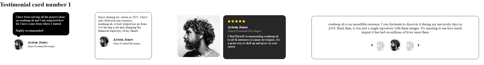
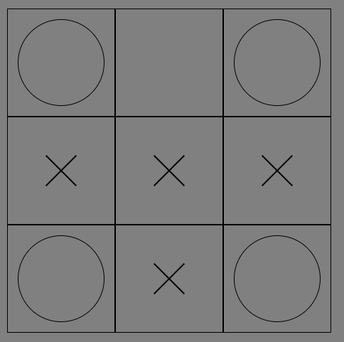
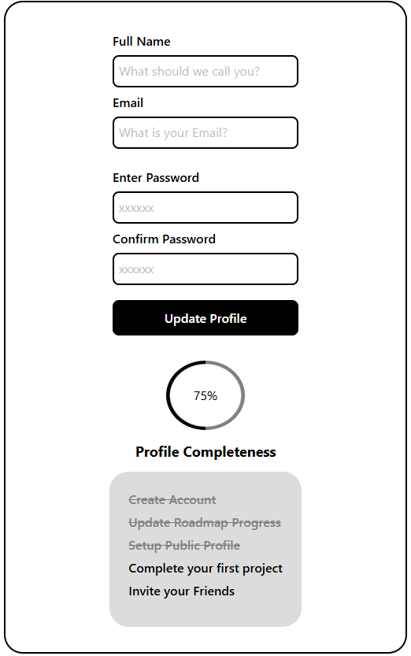
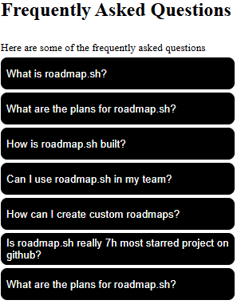
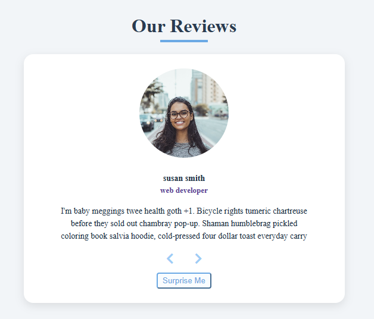
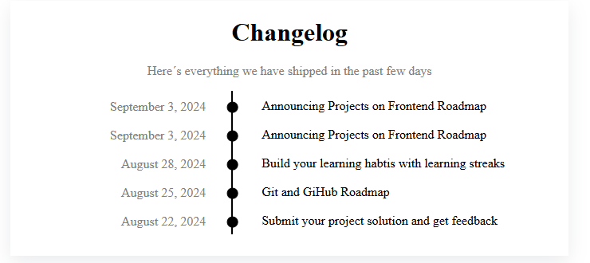
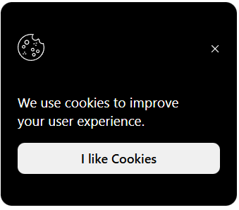
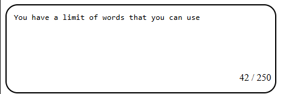
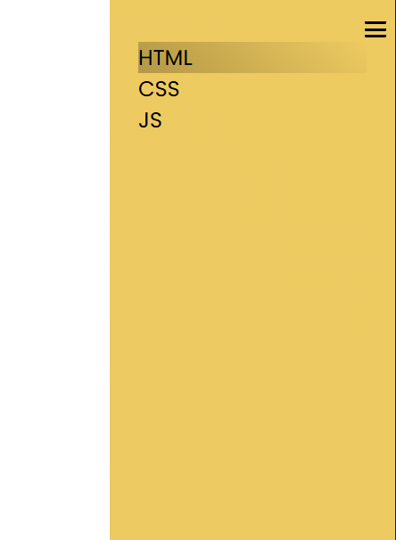
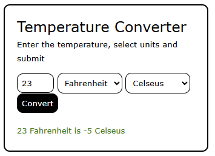

## Roadmap Projects

Project ideas from [roadmap.sh](https://roadmap.sh/javascript/projects)

## Pokemon Gallery

A simple responsive gallery of pokemons. The images are fetch from the [pokemon api](https://pokeapi.co/)

<video width="420" height="240" controls>
  <source src="./resources/pokemon_api_practice.mp4" type="video/mp4">
</video>

## Testimonial Cards

## Tic Tact Toe

## Accesible Form UI

## Acordeon

## AgeCalculator

todo!

## Carousel

## Changelog

## Cookies

## Text Area

## SideBar

## Temperature

